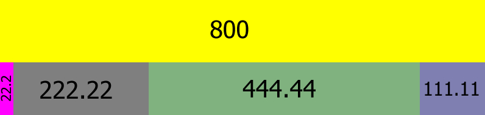

# Discadelta: The High-Precision Rescaling Engine 🦊
## Overview
### Discadelta (Distance + Cascade + Delta) 
Is a high-precision 1D rescaling algorithm designed to partition linear space into constrained, proportional segments. It provides a robust alternative to standard layout solvers by ensuring zero precision loss and fair redistribution of space.

### The Anatomy: Base & Delta
In Discadelta, every segment is treated as a dynamic entity composed of two distinct parts:

* **The Base (Your Compressible Budget)**
Think of the **Base** as the segment's "ideal" starting size. This is the default compressible distance. When the window gets smaller and there isn't enough room to fit everyone, the engine "squeezes" the Base. It represents the primary distance the segment occupies.


* **The Delta (Your Fair Share of Growth)**
The **Delta** is the engine's expansion valve. When the root distance is larger than the sum of all bases, the engine has "excess" distance to give away. The Delta is the fair share value split among sibling segments to refill that expanding distance.

### The 3-Pass Lifecycle: Decoupling Logic from Reality
Discadelta doesn't just "calculate and draw." It uses a strictly decoupled 3-pass architecture. This makes the system fast, predictable, and incredibly flexible.

* **Pass 1: Pre-compute (The Analyst)**:
  This pass validates all inputs (`min`, `max`, `base`) and establishing the "pressure" of the layout. 
  It identifies whether the system needs to enter a Compression or Expansion state and establishes the priority order for processing.


* **Pass 2: Scaling (The Resolver)**: 
  The core mathematical engine. It uses a `Precision Cascade` to resolve the exact final size of every segment. 
  By processing segments based on their constraint priority, it ensures that "fair share" is maintained even when segments hit their min/max limits.


* **Pass 3: Dynamic Placing (The Builder)**: 
  Once every segment knows its size, the Placing Pass translates those distances into world-space offsets (positions). 
  Because this is a separate pass, you can swap or reorder segments visually without ever needing to recalculate the complex scaling math.

## Theory
### Goal
Calculate the distance of an individual segment given the root distance as rescaling destination.

### 1. Fair Share Scenario
The simplest form of partitioning where every segment receives an equal portion of the total distance.

**Method**:
* $rootDistance = 800$
* $numSegments = 4$
* $SegmentDistance = rootDistance / numSegments$


### 2. Expand Delta
When the root distance is larger than the sum of all segment bases, the "Expand Delta" is used to fill the remaining space proportionally.

**Key Definitions**:
1. **Base**: Default distance configuration.
2. **Accumulate Base Distance**: Sum of all validated $base_n$.
3. **Remain Expand Distance**: Leftover free space after subtracting all bases from the root distance.
4. **Expand Ratio**: Normalized expandable portion of a segment.
5. **Accumulate Expand Ratio**: Sum of all $expandRatio_n$.
6. **Expand Delta**: The value added to $base_n$ to fill the remaining space.

**Method**:
* $rootDistance = 800$
* $accumulateBaseDistance = sum(base_n)$
* $accumulateExpandRatio = sum(expandRatio_n)$
* $remainExpandDistance = rootDistance - accumulateBaseDistance$
* $expandDelta = \left( \frac{remainExpandDistance}{accumulateExpandRatio}\right) \times expandRatio_n$


* **Configuration**:

  | Segment | Base   | expandRatio  |
  |---------|--------|--------------|
  | 1       | 100    | 0.5          |
  | 2       | 150    | 1.0          |
  | 3       | 200    | 2.0          |
  | 4       | 50     | 0.5          |

* **Pre-Compute Table**:

  | Metric                  | Iterate               | Sum |
  |-------------------------|-----------------------|-----|
  | accumulateBaseDistance  | 100 + 150 + 200 + 50  | 500 |
  | accumulateExpandRatio   | 0.5 + 1.0 + 2.0 + 0.5 | 4.0 |

  | Metric               | Value             |
  |----------------------|-------------------|
  | rootDistance         | 800               |
  | remainExpandDistance | 800 - 500  =  300 |

* **Dynamic Expand Distance Table**:

  | Segment | reExpandDistance | acExpandRatio | expandDelta     | Base + expandDelta | Distance |
  |---------|------------------|---------------|-----------------|--------------------|----------|
  | 1       | 300              | 4.0           | 300 / 4.0 * 0.5 | 100 + 37.5         | 137.5    |
  | 2       | 300              | 4.0           | 300 / 4.0 * 1.0 | 150 + 75           | 225      |
  | 3       | 300              | 4.0           | 300 / 4.0 * 2.0 | 200 + 150          | 350      |
  | 4       | 300              | 4.0           | 300 / 4.0 * 0.5 | 50  + 37.5         | 87.5     |

* **Total**: `137.5` + `225` + `350` + `87.5` = `800`



### 3. Solving Precision Loss (The Cascade)
Floating-point math can result in small overflows or gaps (e.g., $800.000001$). Discadelta solves this by **cascading** (subtracting) the used values from the remaining pool in each iteration.

**The Cascading Logic**:
1. **Update Cascade Expand Distance**: $cascadeExpandDistance = cascadeExpandDistance - expandDelta_n$
2. **Update Cascade Expand Ratio**: $cascadeExpandRatio = cascadeExpandRatio - segmentRatio_n$

**Method**:
* $rootDistance = 800$
* $accumulateBaseDistance = sum(base_n)$
* $accumulateExpandRatio = sum(expandRatio_n)$
* $cascadeExpandDistance = rootDistance - accumulateBaseDistance$
* $cascadeExpandRatio = accumulateExpandRatio$
* $expandDelta = \left( \frac{cascadeExpandDistance}{cascadeExpandRatio}\right) \times expandRatio_n$


* **Configuration**:

  | Segment | Base   | expandRatio |
  |---------|--------|-------------|
  | 1       | 100    | 0.3         |
  | 2       | 150    | 1.0         |
  | 3       | 70     | 1.0         |
  | 4       | 50     | 0.8         |

* **Pre-Compute Table**:

  | Metric                  | Iterate               | Sum |
  |-------------------------|-----------------------|-----|
  | accumulateBaseDistance  | 100 + 150 + 70 + 50   | 370 |
  | accumulateExpandRatio   | 0.3 + 1.0 + 1.0 + 0.8 | 3.1 |

  | Metric                | Value                                           |
  |-----------------------|-------------------------------------------------|
  | rootDistance          | 800                                             |
  | cascadeExpandDistance | rootDistance(800) - accumulateBaseDistance(370) |
  | cascadeExpandRatio    | accumulateExpandRatio(3.1)                      |

* **Dynamic Expand Distance Table**:

  | Segment | cascadeExpandDistance  | cascadeExpandRatio  | expandDelta           | Base + expandDelta   | Distance        |
  |---------|------------------------|---------------------|-----------------------|----------------------|-----------------|
  | 1       | 430                    | 3.1                 | 430 / 3.1 * 0.3       | 100 + 41.6129032258  | 141.6129032258  |
  | 2       | 388.387096774          | 2.8                 | 388.38... / 2.8 * 1.0 | 150 + 138.7096774194 | 288.7096774194  |
  | 3       | 249.6774193548         | 1.8                 | 249.67... / 1.8 * 1.0 | 70  + 138.7096774193 | 208.7096774193  |
  | 4       | 110.9677419355         | 0.8                 | 110.96... / 0.8 * 0.5 | 50  + 110.9677419355 | 160.9677419355  |


* **Total**: `141.6129032258` + `288.7096774194` + `208.7096774193` + `160.9677419355` = `800`


* **Cascade Table**:

  | Iterate   | cascadeExpandDistance   | expandDelta      | cascadeExpandRatio | expandRatio |
  |-----------|-------------------------|------------------|--------------------|-------------|
  | 0         | 430                     | -41.6129032258   | 3.1                | -0.3        |
  | 1         | 388.387096774           | -138.7096774194  | 2.8                | -1.0        |
  | 2         | 249.6774193548          | -138.7096774193  | 1.8                | -1.0        |
  | 3         | 110.9677419355          | -110.9677419355  | 0.8                | -0.8        |


## Compress Base Distance (Underflow Handling)
When the total base distance required is greater than the root distance ($rootBase < accumulateBaseDistance$), the algorithm scales bases down proportionally while protecting "Solidified" areas.

**Key Definitions**:
1. **Compress Solidify**: The "unyielding" portion of a segment that acts as a hard anchor.
2. **Compress Capacity**: The "flexible" portion that scales down first.
3. **Cascade Compress Distance**: Remaining root distance to be distributed.
4. **Cascade Compress Solidify** Remaining compress solidify to offset compress base distance.
5. **Cascade Base Distance** Remaining base distance for calculating the remaining capacity.


**Method**:
* $rootDistance = 800$
* $compressCapacity_n = base_n * compressRatio_n$
* $compressSolidify_n = base_n - compressCapacity_n$
* $accumulateBaseDistance = sum(base_n)$
* $accumulateCompressSolidify = sum(compressSolidify_n)$
* $cascadeCompressDistance = rootDistance$
* $cascadeBaseDistance = accumulateBaseDistance$
* $cascadeCompressSolidify = accumulateCompressSolidify$
* $$compressBaseDistance = \left( \frac{remainShareDistance - remainSolidify}{remainBase - remainSolidify} \right) \times compressBase + compressSolidify$$


* **Configuration**:

  | Segment | Base | compressRatio | expandRatio  |
  |---------|------|---------------|--------------|
  | 1       | 200  | 0.7           | 0.1          |
  | 2       | 300  | 1.0           | 1.0          |
  | 3       | 150  | 1.0           | 2.0          |
  | 4       | 250  | 0.3           | 0.5          |


* **Pre-Compute Table**:

  | Metric                     | Iterate               | Sum |
  |----------------------------|-----------------------|-----|
  | compressCapacity           | 170 , 300 , 150 ,  75 | -   |
  | compressSolidify           | 60  ,   0 ,   0 , 175 | -   |
  | accumulateBaseDistance     | 200 + 300 + 150 + 250 | 900 |
  | accumulateCompressSolidify | 60  +   0 +   0 + 175 | 235 |

  | Metric                  | Value                           |
  |-------------------------|---------------------------------|
  | rootDistance            | 800                             |
  | cascadeCompressDistance | rootDistance(800)               |
  | cascadeBaseDistance     | accumulateBaseDistance(900)     |
  | cascadeCompressSolidify | accumulateCompressSolidify(235) |

* **Dynamic Base Table**:

  | Segment | Compress Solidify | Compress Capacity | Compress Distance |
  |---------|-------------------|-------------------|-------------------|
  | 1       | 60                | 140               | 178.9474          |
  | 2       | 0                 | 300               | 254.8872          |
  | 3       | 0                 | 150               | 127.4436          |
  | 4       | 175               | 75                | 238.7218          |


* **Total**: `178.9474` + `254.8872` + `127.4436` + `238.7218` = `800`


* **Cascade Table**:

  | Iterate   | cascadeCompressDistance  | Compress Distance  | cascadeBaseDistance  | base | cascadeCompressSolidify  | solidify |
  |-----------|--------------------------|--------------------|----------------------|------|--------------------------|----------|
  | 0         | 800                      | -178.9474          | 900                  | -200 | 235                      | -60      |
  | 1         | 621.0526                 | -254.8872          | 700                  | -300 | 175                      | -0       |
  | 2         | 366.1654                 | -127.4436          | 400                  | -150 | 175                      | -0       |
  | 3         | 238.7218                 | -238.7218          | 250                  | -250 | 175                      | -175     |


## Important Notes
- **Parameter Validation**: All input configurations (Bases, Expand Ratios, Compress Ratios) MUST be clamped to a minimum of 0.0 to prevent logical corruption.
- **Cascade Sequence**: Because the cascade is sequential, the order of segments can slightly affect sub-pixel distribution.
- **Precision**: All remainders reach exactly 0 due to the cascading subtraction logic.

## Code Sample (C++23)
Below is the implementation of the **Underflow Handling** scenario, ensuring the total distance exactly matches the root.

```cpp
#include <iostream>
#include <vector>
#include <format>
#include <iomanip>

struct DiscadeltaSegment {
    float base;
    float expandDelta;
    float distance;
};

struct DiscadeltaSegmentConfig {
    float base;
    float compressRatio;
    float expandRatio;
};

int main()
{
    std::vector<DiscadeltaSegmentConfig> segmentConfigs{
        {200.0f, 0.7f, 0.1f},
        {300.0f, 1.0f, 1.0f},
        {150.0f, 1.0f, 2.0f},
        {250.0f, 0.3f, 0.5f}
    };

    // std::vector<DiscadeltaSegmentConfig> segmentConfigs{
    //         {100.0f, 1.0f, 0.3f},
    //         {150.0f, 1.0f, 1.0f},
    //         {70.0f, 1.0f, 1.0f},
    //         {50.0f, 1.0f, 0.8f}
    // };

    const size_t segmentCount = segmentConfigs.size();

    std::vector<DiscadeltaSegment> segmentDistances(segmentCount);


#pragma region // Prepare Compute Context
    constexpr float rootBase = 800.0f;

    // Internal containers for validated data
    std::vector<float> compressCapacities{};
    compressCapacities.reserve(segmentCount);
    std::vector<float> compressSolidifies{};
    compressSolidifies.reserve(segmentCount);
    std::vector<float> baseDistances{};
    baseDistances.reserve(segmentCount);
    std::vector<float> expandRatios{};
    expandRatios.reserve(segmentCount);

    float accumulateBaseDistance{0.0f};
    float accumulateCompressSolidify{0.0f};
    float accumulateExpandRatio{0.0f};

    for (size_t i = 0; i < segmentCount; ++i) {
        const auto &[rawBase, rawCompressRatio, rawExpandRatio] = segmentConfigs[i];

        // --- VALIDATION STEP ---
        // Clamp all configurations to 0.0 to prevent negative distance logic errors
        const float base = std::max(rawBase, 0.0f);
        const float compressRatio = std::max(rawCompressRatio, 0.0f);
        const float expandRatio = std::max(rawExpandRatio, 0.0f);

        // Calculate base proportion metrics
        const float compressCapacity = base * compressRatio;
        const float compressSolidify = base - compressCapacity;

        compressCapacities.push_back(compressCapacity);
        compressSolidifies.push_back(compressSolidify);
        baseDistances.push_back(base);

        // Accumulate metrics
        accumulateBaseDistance += base;
        accumulateCompressSolidify += compressSolidify;

        DiscadeltaSegment& segment = segmentDistances[i];
        segment.base = base;
        segment.distance = base;

        expandRatios.push_back(expandRatio);
        accumulateExpandRatio += expandRatio;
    }


#pragma endregion //Prepare Compute Context

#pragma region //Compute Segment Base Distance

    if (rootBase < accumulateBaseDistance) {
        //compressing
        float cascadeCompressDistance = rootBase;
        float cascadeBaseDistance = accumulateBaseDistance;
        float cascadeCompressSolidify = accumulateCompressSolidify;

        for (size_t i = 0; i < segmentCount; ++i) {
            const float remainCompressDistance = cascadeCompressDistance - cascadeCompressSolidify;
            const float remainCompressCapacity = cascadeBaseDistance - cascadeCompressSolidify;
            const float& compressCapacity = compressCapacities[i];
            const float& compressSolidify = compressSolidifies[i];
            const float compressBaseDistance = (remainCompressDistance <= 0 || remainCompressCapacity <= 0 || compressCapacity <= 0? 0.0f:
            remainCompressDistance / remainCompressCapacity * compressCapacity) + compressSolidify;

            DiscadeltaSegment& segment = segmentDistances[i];
            segment.base = compressBaseDistance;
            segment.distance = compressBaseDistance; //overwrite pre compute

            cascadeCompressDistance -= compressBaseDistance;
            cascadeCompressSolidify -= compressSolidify;
            cascadeBaseDistance -= baseDistances[i];
        }
    }
    else {
        //Expanding
        float cascadeExpandDistance = std::max(rootBase - accumulateBaseDistance, 0.0f);
        float cascadeExpandRatio = accumulateExpandRatio;

        if (cascadeExpandDistance > 0.0f) {
            for (size_t i = 0; i < segmentCount; ++i) {
                const float& expandRatio = expandRatios[i];
                const float expandDelta = cascadeExpandRatio <= 0.0f || expandRatio <= 0.0f? 0.0f :
                cascadeExpandDistance / cascadeExpandRatio * expandRatio;

                segmentDistances[i].expandDelta = expandDelta;
                segmentDistances[i].distance += expandDelta; //add to precompute

                cascadeExpandDistance -= expandDelta;
                cascadeExpandRatio -= expandRatio;
            }
        }
    }

#pragma endregion //Compute Segment Base Distance


#pragma region //Print Result
    std::cout << "\n=== Dynamic Base Segment (Underflow Handling) ===\n";
    std::cout << std::format("Root distance: {:.4f}\n\n", rootBase);

  std::cout << std::string(123, '-') << '\n';
    // Table header
    std::cout << std::left
              << std::setw(2) << "|"
              << std::setw(10) << "Segment"
              << std::setw(2) << "|"
              << std::setw(20) << "Compress Solidify"
              << std::setw(2) << "|"
              << std::setw(20) << "Compress Capacity"
              << std::setw(2) << "|"
              << std::setw(20) << "Compress Distance"
              << std::setw(2) << "|"
              << std::setw(20) << "Expand Delta"
              << std::setw(2) << "|"
              << std::setw(20) << "Scaled Distance"
              << std::setw(2) << "|"
              << '\n';

    std::cout << std::string(123, '-') << '\n';
    float total{0.0f};
    for (size_t i = 0; i < segmentCount; ++i) {
        const auto& res = segmentDistances[i];

        total += res.distance;

        std::cout << std::fixed << std::setprecision(3)
                  << std::setw(2) << "|"
                  << std::setw(10) << (i + 1)
                  << std::setw(2) << "|"
                  << std::setw(20) << std::format("Total: {:.4f}",compressSolidifies[i])
                  << std::setw(2) << "|"
                  << std::setw(20) << std::format("Total: {:.4f}",compressCapacities[i])
                  << std::setw(2) << "|"
                  << std::setw(20) << std::format("Total: {:.4f}",res.base)
                  << std::setw(2) << "|"
                  << std::setw(20) << std::format("Total: {:.4f}",res.expandDelta)
                  << std::setw(2) << "|"
                  << std::setw(20) << std::format("Total: {:.4f}",res.distance)
                  << std::setw(2) << "|"
                  << '\n';
    }

        std::cout << std::string(123, '-') << '\n';
        std::cout << std::format("Total: {:.4f} (expected 800.0)\n", total);
        #pragma endregion //Print Result

        return 0;
    }
```

## Summary

Chapter 1 establishes the foundation for static partitioning. By using the Cascade method, Discadelta ensures that no matter how complex the ratios are, the sum of segments will always equal the root distance exactly.

### Next Chapter: [Discadelta: Pre-compute & Scaling Pass Constraints](discadelta-algorithm-constraints.md)